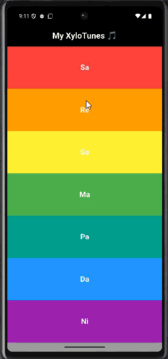

# 🎵 My XyloTunes - Flutter App

A colorful Flutter xylophone app that plays musical notes with smooth gradient UI and vibration feedback.

## 🚀 Features
- 7 musical keys with unique colors
- Gradient background
- Vibration feedback
- Uses audioplayers package

## 🧰 Built With
- Flutter
- Dart
- audioplayers

## App Preview

  
💡 Created with ❤️ by Pothula Siva Anand
